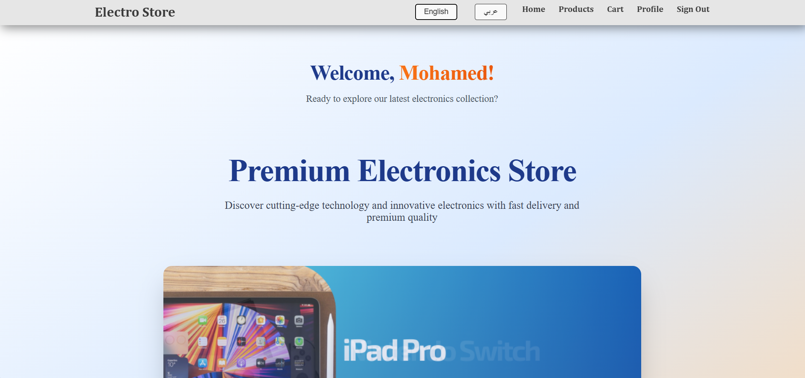

# ElectroStore

#### [GitHubBackEnd](https://github.com/NOORSALMAN25/ElectroStore-backEnd) | [GitHubFrontEnd](https://github.com/NOORSALMAN25/ElectroStore-frontEnd)

---

## Description

#### Our project is a full-stack e-commerce platform for electronics that removes the need for physical store visits by allowing customers to browse a wide range of products with detailed descriptions, images, and specifications, all updated in real time. Users can add items to their basket for a smooth and secure checkout experience. For store managers, the platform includes an admin view to add new products so customers can purchase them, as well as delete outdated or out-of-stock items to make room for new ones, ensuring the store is always accurate, fresh, and up to date.

## Getting Started

#### Upon opening the website, the user will immediately see the available types of electronic devices displayed on the homepage, allowing them to easily explore the categories and choose the section they want to shop from.

## Technologies Used

- **React** – Frontend UI library for building interactive interfaces
- **Node.js** – JavaScript runtime environment for backend services
- **Express.js** – Backend framework for handling routes and APIs
- **MongoDB** – NoSQL database for storing application data
- **CSS** – Styling and layout design
- **RESTful APIs** – Communication between frontend and backend
- **MERN Stack** – Combination of MongoDB, Express, React, and Node for full-stack development

## Screenshot

Screenshot for the application

## **Entity Relationship Diagram (ERD)**

The ERD below illustrates the database structure of the application, defining how entities relate to each other.

- **User** – Stores user account details such as name, email, password, and role.
- **Product** – Contains product information including name, description, price, category, image, and availability status.
- **Review** – Holds user-generated reviews linked to both the product and the user.
- **Order** – Stores order details including date, total amount, order items, user reference, and status.

These relationships ensure consistent data organization and support core functionalities such as product management, order tracking, and user reviews.

## **Component Tree**

The Component Tree outlines the main structure of the frontend React application, showing how components are organized and nested.

It starts from `main.jsx` and `App`, branching out into major sections like:

- Authentication: **SignUp**, **Login**
- Navigation: **Nav**, **Home**
- Product Management: **Add Product**, **Products**, **Product Card**, **Product**, **Edit Product**
- User Profile: **Profile**
- Shopping Functionality: **Cart**, **Check Out**

> **Note:** This diagram serves as a high-level conceptual guide.  
> The actual implementation in the code may vary due to routing, conditional rendering, or component reuse.

## **Unsolved Problems**

- When users click the **Buy** button, the entire cart is intentionally cleared. However, the issue is that items are also removed from the database, meaning they will not appear in the previous orders feature once it is implemented.
- Sometimes product images break in the cart. The exact cause of this issue is still unknown.

## **Possible Future Enhancements**

- **Previous Orders Feature** – A page that allows the user to view their past orders along with all the details.
- **Order Ratings & Filtering** – Display the average rating of each order and allow filtering by date or number of stars.
- **Responsive Design** – Adapt the interface to different screen sizes for a better user experience on all devices.
- **Printable Receipt** – Generate a printable receipt in case the application is used as a POS (Point of Sale) system.

## **Credits**

- Special thanks to our amazing project supervisor [Michael Lackey](https://www.linkedin.com/in/michaelglackey/) for guidance, feedback, and Support.
- Team brainstorming and task management via [Trello](https://trello.com/).

### Frontend

1. [react-i18next](https://www.npmjs.com/package/react-i18next) – Internationalization (i18n) library for React to support multiple languages.
2. [EmailJS (React Example)](https://www.emailjs.com/docs/examples/reactjs/) – Service for sending emails directly from the client side without a backend.

#### Style & Design

1. [Canva](https://www.canva.com/) – Used for creating design assets and visual elements.
2. [Color Hunt](https://colorhunt.co/) – Source for modern color palettes and inspiration.

#### Backend

1. Assistance from the **Luqma Project** team in implementing the user profile feature.

# 👤 Authors (Developed by)

### Mohamed Alsaegh

📫 Email: [mad6717@gmail.com](mailto:mad6717@gmail.com) | 🔗 GitHub: [MohamedAlsaegh](https://github.com/MohamedAlsaegh) | 💼 LinkedIn: [MohamedAlsaegh](https://www.linkedin.com/in/mohamed-alsaegh-304ab31a3/)

### Noor Salman

🔗 GitHub: [NOORSALMAN25](https://github.com/NOORSALMAN25) | 💼 LinkedIn: [Noor Salman
](https://www.linkedin.com/in/noorsalman10/)

### Mariam Salah

📫 Email: [maryamsalah233@gmail.com](mailto:maryamsalah233@gmail.com) | 🔗 GitHub: [Mariam Salah](https://github.com/maryamsali2) | 💼 LinkedIn: [Maryam Ali](https://www.linkedin.com/in/maryamsalahsaleh/)

---

[⬆ return to the top](#-Unsolved-Problems)
